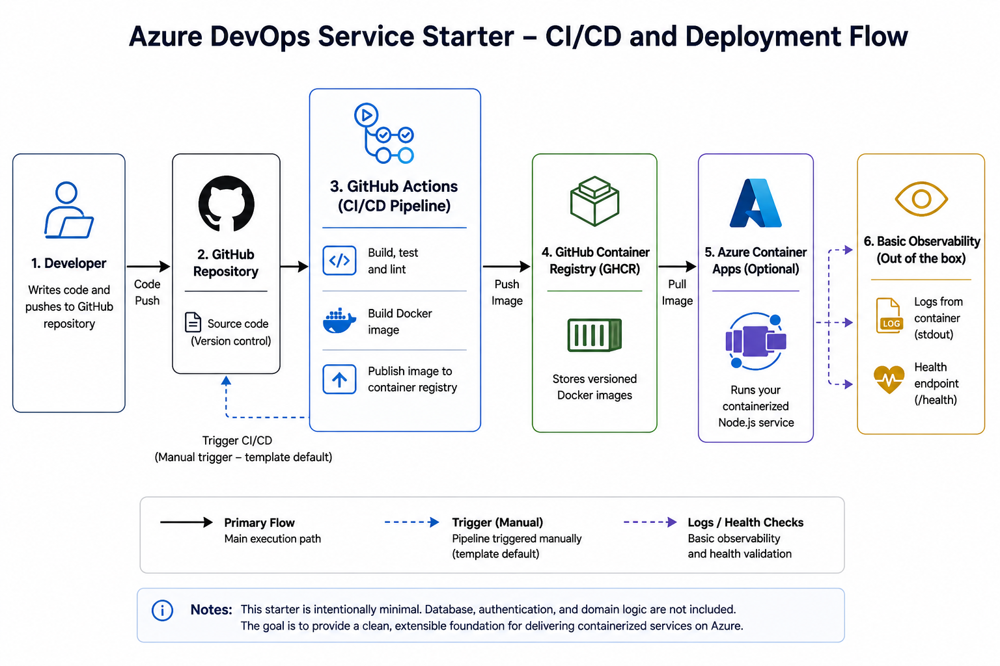

# Azure DevOps Service Starter

Azure DevOps service starter built as a public portfolio demo, demonstrating CI/CD, Docker, testing, logging, health checks, and Azure-ready infrastructure.

## Architecture Overview


<p><em>High-level CI/CD and deployment flow for the service starter.</em></p>

## Project Structure

- `src/config`: runtime configuration
- `src/routes`: HTTP endpoints
- `src/middleware`: logging and error handling
- `tests`: endpoint tests
- `infra`: Azure (Bicep)
- `docs`: architecture notes

See `docs/ARCHITECTURE.md` for details.

## IT Operations & Modern Workplace Relevance

Beyond CI/CD and deployment, this repository is documented as something that can
actually be *operated and supported*. It demonstrates:

- **Reproducible deployment** — immutable, SHA-tagged container images and Bicep
  infrastructure-as-code.
- **Operational documentation** — a runbook, access-control model, and
  onboarding/offboarding checklists.
- **Health checks & monitoring thinking** — `/health` and `/ready` endpoints with
  structured stdout logging ready for centralized log collection.
- **Incident response** — a realistic support flow from "user reports an outage"
  through triage, log review, deployment check, escalation, and documentation.
- **Access control & security baseline** — a simple role model and practical
  least-privilege / secrets-hygiene expectations.

This makes the repo relevant to **IT Support, System Operations, Azure, CI/CD,
technical documentation, and service reliability** — not just application
delivery. It is a reusable service template with serious operational
documentation, not a full enterprise platform.

### Operational Documentation

- [Operations Runbook](docs/OPERATIONS_RUNBOOK.md) — health checks, restart/redeploy, log review, triage, rollback, escalation
- [Access Control](docs/ACCESS_CONTROL.md) — Owner/Admin, Developer, Support, Viewer role model
- [Onboarding & Offboarding](docs/ONBOARDING_OFFBOARDING.md) — access grant/removal and handover checklists
- [Security Baseline](docs/SECURITY_BASELINE.md) — secrets, least privilege, dependency and image hygiene
- [Architecture](docs/ARCHITECTURE.md) — app structure and operational view
- [Incident Simulation](docs/INCIDENT_SIMULATION.md) — worked support/incident walkthrough
- [Operational Changelog](docs/CHANGELOG_OPERATIONS.md) — example record of deploys, incidents, and access changes

## API Endpoints

- `GET /` → service metadata (name, environment, version)
- `GET /health` → liveness (uptime, timestamp)
- `GET /ready` → readiness
- `GET /api/incidents/demo` → simulated incident payload

## CI/CD Pipeline

CI/CD is disabled by default. Enable it by updating the GitHub Actions triggers and providing the required secrets.

When run manually:

1. `npm ci`
2. `npm test`
3. `npm run build`
4. `npm run lint`
5. `docker build`
6. Push image to GHCR:  
   `ghcr.io/${{ github.repository }}:${{ github.sha }}`
7. Optional `latest` tag

Uses `GITHUB_TOKEN`. Azure deploy is optional.

## Local Development

```bash
npm install
cp .env.example .env
npm run dev
```

Runs on `http://localhost:3000`.

## Starter Customization

```bash
./scripts/init-template.sh my-service-name
```

Updates common identifiers. Review changes after running.

## Docker

```bash
docker build -t azure-devops-service-starter .
docker run -p 3000:3000 --env-file .env azure-devops-service-starter
```

```bash
docker compose up --build
```

Runs with basic health check and restart policy for local testing.

## Testing

```bash
npm test
npm run build
npm run lint
```

## Infrastructure (Azure)

`infra/main.bicep` provides a minimal Container Apps setup:

- Log Analytics
- Container Apps environment
- Container App

Example:

```bash
az deployment group create \
  --resource-group my-rg \
  --template-file infra/main.bicep \
  --parameters appName=my-service containerImage=ghcr.io/my-org/my-service:latest
```

## Deployment Options

- **Azure Container Apps**: deploy the built image
- **Azure App Service**: container-based deployment
- **Extend IaC**: expand Bicep or switch to Terraform

## Secrets

- GHCR uses `GITHUB_TOKEN`
- Azure uses `AZURE_CREDENTIALS`, `AZURE_RESOURCE_GROUP`, `AZURE_CONTAINER_APP_NAME`
- Store secrets in GitHub Secrets or Azure Key Vault
- Do not commit credentials

## What This Shows

- CI/CD pipeline (build → test → package → publish)
- Containerization and reproducible builds
- Basic Azure setup with Bicep
- Service structure with health checks and logging

## Scope

This starter focuses on the delivery pipeline and service structure.

It intentionally excludes:

- database integration
- authentication
- domain-specific logic

The goal is to provide a clean base that can be extended for different services without unnecessary pre-existing complexity.

## What’s Included

- TypeScript Node.js service with a clear structure
- Health and readiness endpoints (`/health`, `/ready`)
- Logging and centralized error handling
- Jest tests
- Docker for local and cloud runs
- GitHub Actions CI/CD (template, disabled by default)
- Docker image publishing to GHCR
- Minimal Azure Container Apps example using Bicep
- Simple starter/template setup for reuse
