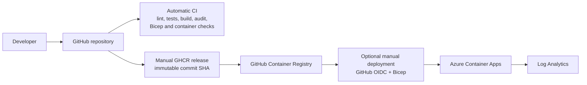

# Azure Container Apps Service Starter

A small, reusable TypeScript service starter that demonstrates GitHub Actions,
GHCR, Docker, Bicep, testing, structured logging, health checks, and operational
documentation. It is a production-minded starter and portfolio demonstration,
not a production-complete application platform.

The repository name and package slug remain `azure-devops-service-starter` for
URL compatibility. This project uses GitHub Actions and Azure Container Apps; it
does not use the Azure DevOps product.

## Delivery flow



- **Automatic CI:** pull requests and pushes to `main` run validation only.
- **Manual release:** `release.yml` publishes the current commit to GHCR using
  the full commit SHA as its immutable tag, with SBOM and provenance.
- **Optional deployment:** the same manual workflow deploys the exact published
  digest only when `deploy_to_azure` is selected. Azure authentication uses
  OIDC and a protected `azure-production` GitHub environment.

No workflow automatically deploys on a push.

## Prerequisites

- Node.js 24 LTS (the repository includes `.nvmrc`)
- npm 11 or the npm version bundled with Node 24
- Docker with Docker Compose for container checks
- Azure CLI with Bicep for infrastructure compilation or deployment
- A GitHub repository with Actions enabled for release automation

## Local-to-cloud walkthrough

### 1. Install and run locally

```bash
nvm use
npm ci
cp .env.example .env
npm run check
npm start
```

In another terminal:

```bash
curl --fail http://localhost:3000/
curl --fail http://localhost:3000/health
curl --fail http://localhost:3000/ready
```

Use `npm run dev` for watch mode. Cloned, lockfile-based setups should use
`npm ci`; use `npm install` only when intentionally changing dependencies.

### 2. Run the container locally

```bash
docker compose up --build --detach
docker compose ps
curl --fail http://localhost:3000/health
docker compose down
```

### 3. Validate infrastructure without deploying

```bash
az bicep build --file infra/main.bicep
```

### 4. Use automatic CI

Open a pull request or push to `main`. `.github/workflows/ci.yml` installs from
the lockfile, lints, tests with coverage, builds, audits production
dependencies, compiles Bicep, builds the image, and smoke-tests container
health. CI has read-only repository permissions and does not publish or deploy.

### 5. Publish an immutable image

Run **Release image and optionally deploy** from the GitHub Actions UI with
`deploy_to_azure` left false. The workflow logs into GHCR with its scoped
`GITHUB_TOKEN` and publishes:

```text
ghcr.io/<lowercase-owner>/<lowercase-repository>:<full-commit-sha>
```

The secret-free Bicep example can pull from GHCR only when the package is
public. Private GHCR packages need registry credentials configured in Container
Apps. For production, Azure Container Registry with managed identity is the
recommended extension.

### 6. Configure optional Azure deployment

Create an existing resource group and an Entra application/service principal
with a GitHub federated credential scoped to the protected
`azure-production` environment. Configure these GitHub environment variables:

- `AZURE_CLIENT_ID`
- `AZURE_TENANT_ID`
- `AZURE_SUBSCRIPTION_ID`

Grant that identity only the Azure RBAC permissions needed to deploy into the
target resource group. Protect the environment with the reviewers appropriate
for the repository. Then run the manual release workflow with
`deploy_to_azure=true`, the resource group, and app name. The Azure job deploys
`infra/main.bicep` with the exact image digest produced by the publish job.

## API endpoints

| Endpoint | Purpose |
| --- | --- |
| `GET /` | Service name, environment, and version |
| `GET /health` | Process liveness, uptime, and timestamp |
| `GET /ready` | Shallow process readiness |
| `GET /api/incidents/demo` | Optional simulated incident response |
| `GET /error-demo` | Optional error-handler demonstration |

`/ready` is intentionally shallow because the starter has no external
dependencies. Add dependency checks when adding databases, queues, or required
upstream services.

Demo routes are available in tests and local development. In
`NODE_ENV=production`, both return 404 unless `ENABLE_DEMO_ROUTES=true` is set
explicitly. Keep the flag false for normal deployments.

Every response includes a generated `x-request-id`. Structured request logs use
the route path without query parameters to avoid leaking query-string values.

## Configuration

See `.env.example`. `PORT` must be between 1 and 65535, and
`ENABLE_DEMO_ROUTES` accepts only `true` or `false`.

## Customize the starter

The initializer validates a lowercase hyphenated service slug, supports a safe
preview, and changes names without creating backup files:

```bash
npm run init:template -- --dry-run my-service
npm run init:template -- my-service
```

Run the non-dry command only in a fresh copy or branch, then review all changes.

## Project structure

- `src/` — Express application, configuration, routes, and middleware
- `tests/` — endpoint and configuration tests
- `infra/` — minimal Azure Container Apps Bicep
- `.github/workflows/` — automatic CI and manual release/deployment
- `docs/` — architecture, security, access, incident, and operations guidance

## Operational documentation

- [Architecture](docs/ARCHITECTURE.md)
- [Operations runbook](docs/OPERATIONS_RUNBOOK.md)
- [Access control](docs/ACCESS_CONTROL.md)
- [Onboarding and offboarding](docs/ONBOARDING_OFFBOARDING.md)
- [Security baseline](docs/SECURITY_BASELINE.md)
- [Incident simulation](docs/INCIDENT_SIMULATION.md)
- [Operational changelog](docs/CHANGELOG_OPERATIONS.md)

## Scope

The starter intentionally excludes authentication, a database, private
networking, custom domains, and domain-specific business logic. The Bicep uses
single-revision mode: a deployment replaces the active revision after it is
ready; it does not demonstrate weighted traffic shifting. Extend the starter
only for requirements the adopting service actually has.
