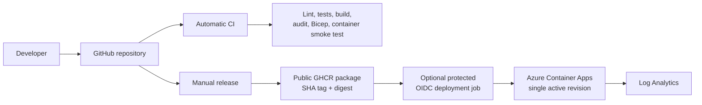

# Architecture

## Purpose and boundaries

Azure Container Apps Service Starter is a small Express 5 service and delivery
example. It demonstrates a credible baseline without claiming to provide a
complete production platform. There is no database, authentication layer,
private network, or business-specific dependency.

## Application structure

- `src/server.ts` owns the HTTP listener and bounded graceful shutdown.
- `src/app.ts` configures Express, a 100 KB JSON limit, middleware, and routes.
- `src/config/env.ts` parses and validates runtime configuration.
- `src/routes/index.ts` provides service, health, readiness, and optional demo
  endpoints.
- `src/middleware/requestLogger.ts` generates a request ID and writes structured
  request logs without query strings.
- `src/middleware/errorHandler.ts` normalizes 404 and unexpected-error responses.

The response exposes the generated request ID as `x-request-id`; request and
error logs include the same value for correlation.

## Request and health behavior

Requests pass through JSON parsing, request logging, routing, the 404 handler,
and the error handler. Express's `x-powered-by` header is disabled.

- `/health` is a liveness signal for the running process.
- `/ready` is deliberately shallow because there are no required dependencies.
  It must be extended when a database, queue, or required upstream service is
  introduced.
- Demo routes exist in tests and local development. Production hides them
  unless `ENABLE_DEMO_ROUTES=true` is explicitly configured.

## Delivery and deployment

CI runs automatically but has no package or Azure write access. Publishing is
manual and produces an immutable commit-SHA tag plus digest. Deployment is a
separate opt-in job that authenticates through GitHub OIDC and applies the
included Bicep using Azure CLI.

The current infrastructure uses Container Apps **Single** revision mode. It
does not configure simultaneous revisions or weighted traffic shifting.

## Azure resources

`infra/main.bicep` creates a Log Analytics workspace, a Container Apps managed
environment, and one TLS-only public Container App. Liveness and readiness
probes call the service endpoints directly. A zero minimum replica default
reduces idle cost but can introduce a cold start after scale-to-zero.

The secret-free example assumes a public GHCR package. Private GHCR requires
registry credentials; ACR with managed identity is the recommended production
extension.
